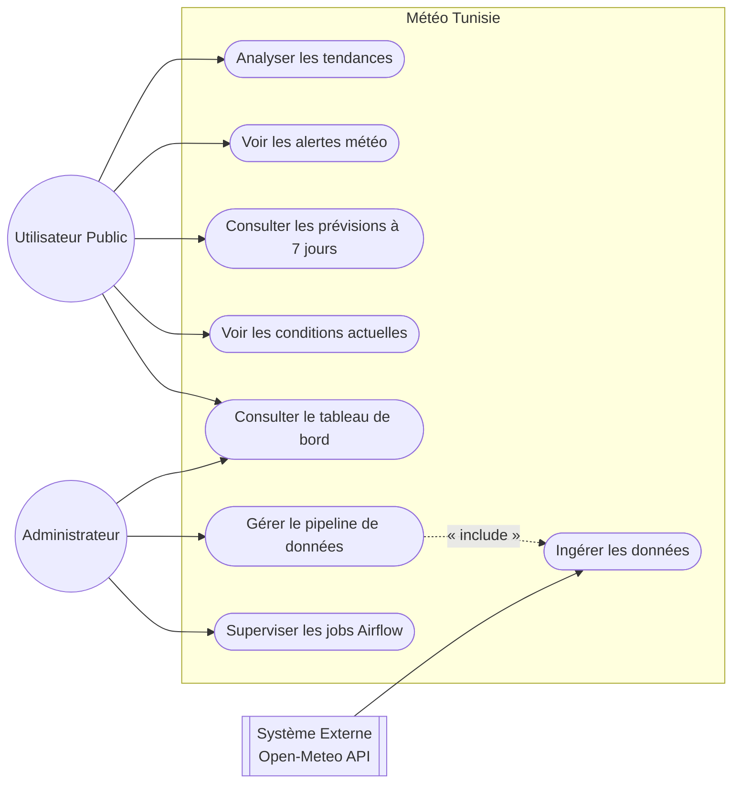
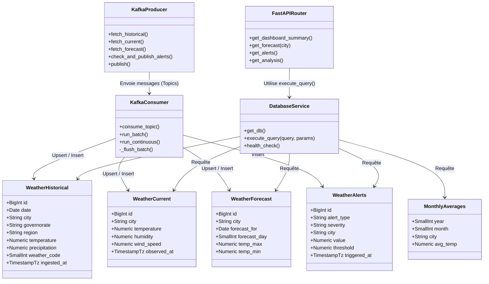
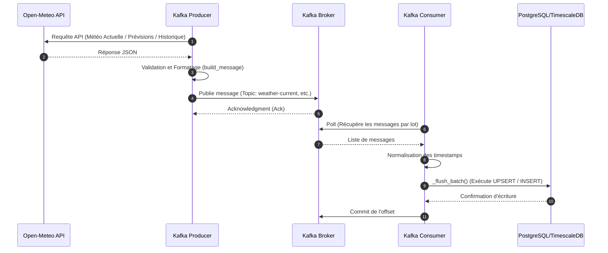
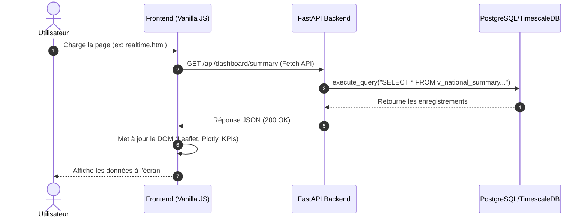
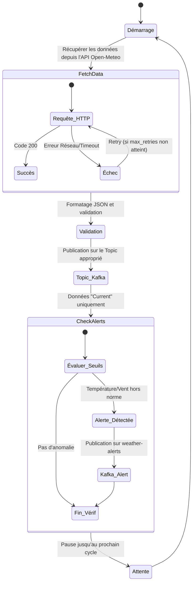
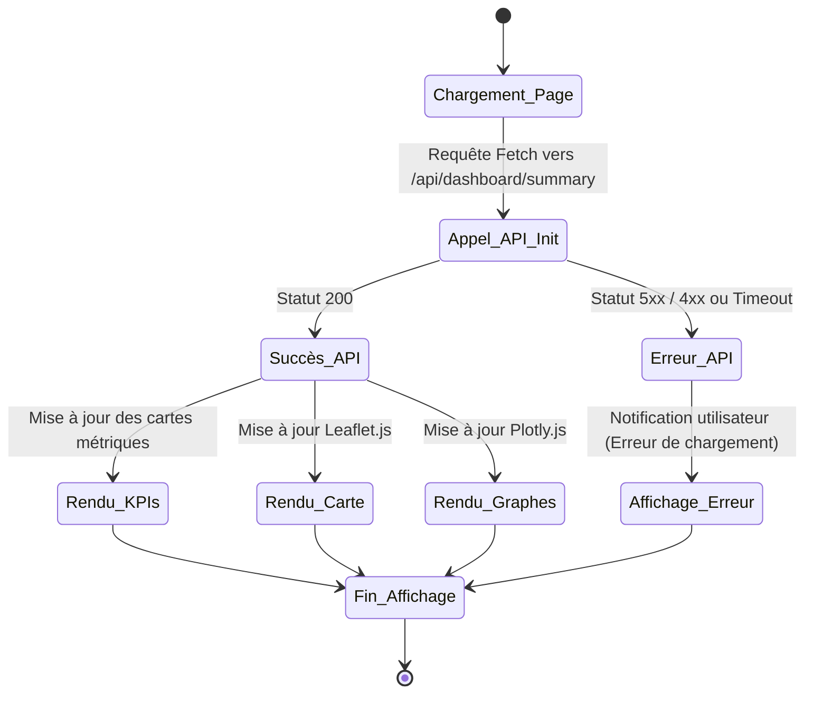

# Diagrammes UML - Météo Tunisie

Ce document présente l'architecture et les flux principaux de la plateforme **Météo Tunisie** sous forme de diagrammes UML (Mermaid.js).

---

## 1. Diagramme des Cas d'Utilisation (Use Case)

Ce diagramme illustre les interactions possibles des utilisateurs (Administrateur et Utilisateur Public) avec le système.



---

## 2. Diagramme de Classes (Class Diagram)

Ce diagramme offre une vue de haut niveau sur l'architecture backend, le schéma de base de données (TimescaleDB) et les composants de traitement (FastAPI et Kafka).



---

## 3. Diagrammes de Séquence (Sequence Diagrams)

### 3.1. Pipeline d'ingestion de données

Ce diagramme montre le cheminement des données depuis l'API source (Open-Meteo) jusqu'au stockage PostgreSQL (TimescaleDB).



### 3.2. Interaction du tableau de bord utilisateur

Ce diagramme détaille le flux lorsqu'un utilisateur interagit avec l'interface frontend pour récupérer les données via l'API FastAPI.



---

## 4. Diagrammes d'Activité (Activity Diagrams)

### 4.1. Processus d'Ingestion des Données (Producteur)



### 4.2. Processus d'Interaction avec le Dashboard (Frontend)



---

## 5. Diagramme de Déploiement (Deployment Diagram)

Ce diagramme illustre la façon dont l'application est déployée sur différents conteneurs (via Docker Compose).

```mermaid
flowchart TD
    subgraph Client [Navigateur Web]
        UI[Interface Vanilla JS / HTML]
    end

    subgraph DockerHost [Hôte Docker (Serveur / Local)]

        subgraph ServeurWeb [Conteneur Nginx]
            Nginx[Nginx : Sert les fichiers statiques]
        end

        subgraph Backend [Conteneur FastAPI]
            API[FastAPI Uvicorn]
        end

        subgraph Pipeline [Conteneurs Python]
            Prod[Kafka Producer]
            Cons[Kafka Consumer]
        end

        subgraph MessageBroker [Conteneur Kafka]
            Zook[Zookeeper] --- KBroker[Kafka Broker]
        end

        subgraph BaseDeDonnees [Conteneur PostgreSQL]
            DB[(PostgreSQL 15 + TimescaleDB)]
        end

        subgraph Orchestration [Conteneurs Airflow]
            AirflowUI[Airflow Webserver]
            AirflowSched[Airflow Scheduler]
        end
    end

    Client -->|HTTP/REST| ServeurWeb
    ServeurWeb -->|Proxy Inversé| API

    API -->|TCP / psycopg2| DB
    Prod -->|TCP| KBroker
    KBroker -->|TCP| Cons
    Cons -->|TCP / psycopg2| DB
    AirflowSched -->|Exécute DAGs / db.execute_query| DB
```
